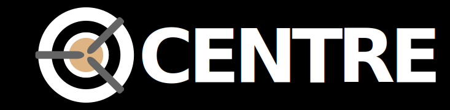

# centre

- Project name: centre
- Programming language: JavaScript
- Package manager: Npm
- UI framework: Tailwind CSS
- Nuxt.js modules: Axios - Promise based HTTP client
- Rendering mode: Universal (SSR / SSG)
- Deployment target: Static (Static/Jamstack hosting)
- Version control system: Git
- Headless CMS: contentful
- Deploy System: Netlify
